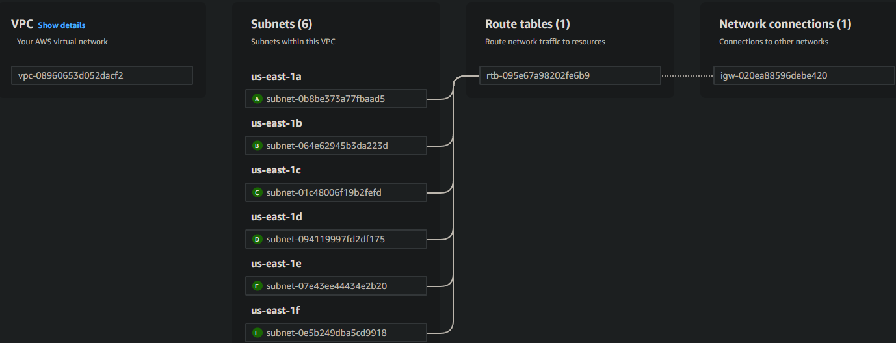
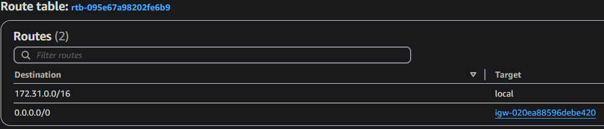
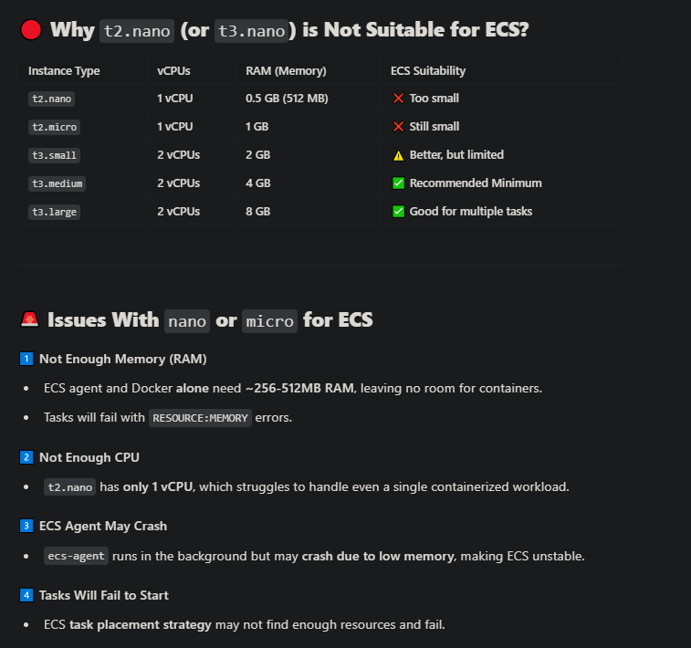

# Moving App to Amazon ECS via CI/CD Pipeline

This guide will walk you through the process of migrating your local app to **Amazon ECS** using a **CI/CD pipeline**. The steps include creating an **ECR repository**, authenticating via AWS CLI, uploading a Docker image to **Amazon ECR**, and setting up a pipeline to automate deployments to ECS.

---

## Prerequisites

- **AWS CLI** installed and configured on your machine.
  - If not installed, follow [this link](https://docs.aws.amazon.com/cli/latest/userguide/install-cliv2.html) for installation instructions.
  - Ensure you have valid AWS credentials by running `aws configure`.
  - Install eksctl  [this link](https://eksctl.io/installation/) for installation instructions.
  
- **Docker** installed on your machine.
  - If not installed, follow [this link](https://docs.docker.com/get-docker/) for installation instructions.
  
- **GitHub account** to host your repository for CI/CD pipeline.

- An **AWS account** with access to **Amazon ECS**, **ECR**, and **IAM** permissions for creating and managing resources.

---

## Step 1: Create an Amazon ECR Repository

1. **Log in to AWS Console** and navigate to **Amazon ECR**.
2. Click on **Create repository**.
3. Choose **Private** repository.
4. Provide a name for the repository (e.g., `my-app-repo`).
5. Click **Create repository** to create the repository.

Alternatively, you can create the repository using the **AWS CLI**:

```bash
aws ecr create-repository --repository-name my-app-repo
```

## Pipeline way to create and update this repository 

Its crucial to establish flow of project, it will trigger script each time files change. If we edit a file or add new feature,
pipeline will propage new image to repo then restart the application to make update
```
name: CI/CD Pipeline for ECS Deployment

on:
  push:
    branches:
      - main

jobs:
  build-and-deploy:
    runs-on: ubuntu-latest

    steps:
      # Checkout code from repository
      - name: Checkout repository
        uses: actions/checkout@v2

      # Set up AWS CLI
      - name: Set up AWS CLI
        uses: aws-actions/configure-aws-credentials@v1
        with:
          aws-access-key-id: ${{ secrets.AWS_ACCESS_KEY_ID }}
          aws-secret-access-key: ${{ secrets.AWS_SECRET_ACCESS_KEY }}
          aws-region: us-east-1

      # Log in to Amazon ECR
      - name: Authenticate Docker to Amazon ECR
        run: |
          aws ecr get-login-password --region us-east-1 | docker login --username AWS --password-stdin 123456789012.dkr.ecr.us-east-1.amazonaws.com

      # Build Docker image
      - name: Build Docker image
        run: |
          docker build -t 123456789012.dkr.ecr.us-east-1.amazonaws.com/my-app-repo:latest .

      # Push Docker image to ECR
      - name: Push Docker image to ECR
        run: |
          docker push 123456789012.dkr.ecr.us-east-1.amazonaws.com/my-app-repo:latest

      # Deploy to ECS (add ECS task definition and service update here)
      # Example: Use AWS CLI to update ECS service with new image
      - name: Deploy to Amazon ECS
        run: |
          ecs-cli configure --region us-east-1 --access-key ${{ secrets.AWS_ACCESS_KEY_ID }} --secret-key ${{ secrets.AWS_SECRET_ACCESS_KEY }}
          ecs-cli compose --file docker-compose.yml service up
```
## Step 2: Choice your ECS variant

# 🚀 Amazon ECS Deployment Options

Amazon Elastic Container Service (ECS) provides multiple deployment options based on your workload, control requirements, and infrastructure preferences. This guide explains all ECS options and when to use them.

---

## **1️⃣ ECS on EC2 (EC2 Launch Type) 🏗️**

### ✅ What It Is:
- Runs ECS tasks on **self-managed EC2 instances**.
- You have full control over **instance type, networking, storage, and scaling**.

### 📌 Best For:
- Workloads needing **custom AMIs, GPUs, or persistent storage**.
- **Cost-sensitive** applications using **Spot instances**.
- Cases where **manual instance scaling** is acceptable.

### ❌ Downsides:
- **Requires instance management** (OS updates, monitoring, scaling, etc.).
- **Longer provisioning times** compared to Fargate.

---

## **2️⃣ ECS on Fargate (Fargate Launch Type) 🚀**

### ✅ What It Is:
- **Serverless ECS** – AWS manages the infrastructure.
- No need to provision or maintain EC2 instances.

### 📌 Best For:
- **Auto-scaling applications** with varying workloads.
- **Teams wanting to focus on application development** instead of infrastructure.
- Short-lived **batch jobs or event-driven workloads**.

### ❌ Downsides:
- **Slightly higher cost** than EC2 for always-on workloads.
- **Limited configuration options** compared to EC2.

---

## **3️⃣ ECS on AWS Outposts 🌍**

### ✅ What It Is:
- Runs ECS workloads **on-premises** using AWS-managed hardware.
- Ideal for organizations requiring **low-latency on-prem deployments**.

### 📌 Best For:
- **Hybrid cloud deployments** where data must stay on-prem.
- Industries requiring **data residency compliance**.
- **Consistent AWS experience** across cloud and on-premises.

### ❌ Downsides:
- Requires AWS Outposts hardware (**expensive**).
- **Limited regional availability**.

---

## **4️⃣ ECS Anywhere 🌎**

### ✅ What It Is:
- Extends ECS to **self-managed infrastructure**, including on-prem or other cloud providers.
- Uses **AWS for orchestration**, while containers run on **your own servers**.

### 📌 Best For:
- **Hybrid cloud or multi-cloud strategies**.
- **Edge computing** requiring local processing.
- Businesses wanting **AWS ECS features** on their own hardware.

### ❌ Downsides:
- **You must manage your own infrastructure** (servers, security, scaling).
- **Networking complexity** (requires AWS Agents and secure connection).

---

## **🛠️ Which One Should You Choose?**

| **ECS Option** | **Best For** | **Management Overhead** | **Cost Efficiency** |
|--------------|------------|------------------|----------------|
| **ECS on EC2** | Custom setups, predictable workloads | High | Lower (with Spot instances) |
| **ECS on Fargate** | Serverless, auto-scaling, fast deployment | Low | Higher (pay-per-use) |
| **ECS on Outposts** | Hybrid cloud, on-prem AWS integration | Medium | Expensive hardware |
| **ECS Anywhere** | Self-hosted ECS, hybrid/multi-cloud | High | Varies (own infra costs) |

---

## **🎯 TL;DR**
- Use **ECS on EC2** for cost efficiency & custom configurations.
- Use **ECS on Fargate** for serverless, fully managed workloads.
- Use **ECS on Outposts** for AWS in your **own data center**.
- Use **ECS Anywhere** for **hybrid cloud/self-managed servers**.

**🚀 Choose based on control vs. ease of use vs. cost!**

---

## 🎯 Considering all options choice would be ECS on EC2

For lab purpose its the most flexible option but other hand you learn a lot about deployment stategies, so lets proceed with cluster creation :)

## Step 3: Create an Amazon ECS Cluster

There are some AWS requirements for VPC, Subnets and Security groups. To avoid duplication i will forward you to official article [this link](https://docs.aws.amazon.com/eks/latest/userguide/network-reqs.html)

In few words : we need subnets with at least 8 IP adresses, rules that enable specific  application traffic to communicate outside the world( if required).
All popular setups described in link above.
Here is the VPC & Route table config we will provision






### Until we start lets prepare a bit. To deploy a cluster and nodes we must have appropriate permissions & groups

AmazonEKSAutoClusterRole - this Role must have this permissions:

- AmazonEKSClusterPolicy
- AmazonEKSServicePolicy
- AmazonEC2ContainerRegistryReadOnly
- AmazonEC2FullAccess
- IAMFullAccess
- AWSCloudFormationFullAccess
- AmazonVPCFullAccess

### Trust relationship

This feature decides in AWS which entities (users, roles, services, or accounts) can assume an IAM role. It is a JSON policy attached to an IAM role that grants permissions to other AWS entities to use that role.
Here is what we need for *AmazonEKSAutoClusterRole*
```
{
    "Version": "2012-10-17",
    "Statement": [
        {
            "Effect": "Allow",
            "Principal": {
                "Service": [
                    "eks.amazonaws.com",
                    "ec2.amazonaws.com"
                ],
                "AWS": "arn:aws:iam::992382459406:user/YOUR_AWS_USER"
            },
            "Action": "sts:AssumeRole"
        }
    ]
}
```

Powershell
```
aws eks create-cluster --region us-east-1 --name clusterdamiana `
    --kubernetes-version 1.32 `
    --role-arn arn:aws:iam::992382459406:role/AmazonEKSAutoClusterRole `
    --resources-vpc-config subnetIds=subnet-094119997fd2df175,subnet-0b8be373a77fbaad5,securityGroupIds=sg-00a3c3b55bfc737a1
```

Linux/Mac
```
aws eks create-cluster --region us-east-1 --name clusterdamiana \
    --kubernetes-version 1.32 \
    --role-arn arn:aws:iam::992382459406:role/AmazonEKSAutoClusterRole \
    --resources-vpc-config subnetIds=subnet-094119997fd2df175,subnet-0b8be373a77fbaad5 \
    --security-group-ids sg-00a3c3b55bfc737a1
```

## Step 4: Create NodeGroup


Cluster is ready, now we need compute resources that going to host our applications. Lets provision a nodegroup that takes this responsibilities.
In this step we provide nodegroup name, subnet, scaling strategy, instance type, disk size and keys.
```
aws eks create-nodegroup --cluster-name my-eks-cluster \
    --nodegroup-name my-nodegroup \
    --subnets subnet-094119997fd2df175 subnet-0b8be373a77fbaad5 \
    --node-role arn:aws:iam::992382459406:role/AmazonEKSWorkerNodeRole \
    --scaling-config minSize=1,maxSize=3,desiredSize=2 \
    --instance-types t3.medium \
    --ami-type AL2_x86_64 \
    --disk-size 20 \
    --remote-access ec2SshKey=my-key-pair
```

t3.medium is outside the free tier but for most deployment its minimum that can handle the simplest EKS setup.
t2.nano (free tier) is not sufficient because had only 1GB RAM. docker and kubernetes agents itself required about 600 Mb, if we host even the modest app it would exceed resources



AmazonEKSWorkerNodeRole - the role must have this permissions:
- AmazonEKSWorkerNodePolicy
- AmazonEC2ContainerRegistryReadOnly
- AmazonEKS_CNI_Policy

Key pairs - To create a one go into EC2 ->Dashboard -> Network & Security ->Key pairs. Then you may create pair of keys that enable access to machines via SSH
```
--remote-access ec2SshKey=my-key-pair
```


